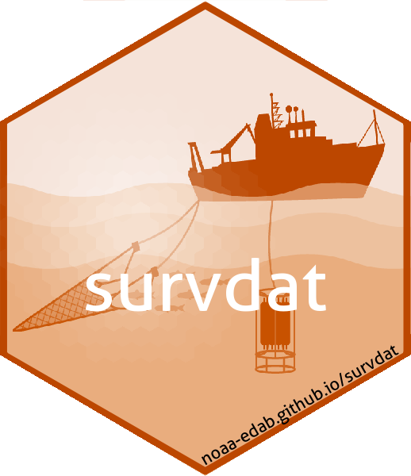

# survdat  

### Everything you need to pull and process the NEFSC survey data

<!-- badges: start -->

 
<!-- badges: end -->

---

## Usage

To use this package you will need:

1.  To be behind the NEFSC firewall
2.  Permissions to access the required server : a username and password.
3.  Oracle's instant Client installed

### Installation

`remotes::install_github("NOAA-EDAB/survdat",build_vignettes = TRUE)`

## Developers (in alphabetical order)

| [andybeet](https://github.com/andybeet)                                                         | [slucey](https://github.com/slucey)                                                                                                    |
|-------------------------------------------------------------------------------------------------|----------------------------------------------------------------------------------------------------------------------------------------|
|  |  |

#### Legal disclaimer

*This repository is a scientific product and is not official
communication of the National Oceanic and Atmospheric Administration, or
the United States Department of Commerce. All NOAA GitHub project code
is provided on an 'as is' basis and the user assumes responsibility for
its use. Any claims against the Department of Commerce or Department of
Commerce bureaus stemming from the use of this GitHub project will be
governed by all applicable Federal law. Any reference to specific
commercial products, processes, or services by service mark, trademark,
manufacturer, or otherwise, does not constitute or imply their
endorsement, recommendation or favoring by the Department of Commerce.
The Department of Commerce seal and logo, or the seal and logo of a DOC
bureau, shall not be used in any manner to imply endorsement of any
commercial product or activity by DOC or the United States Government.*

[U.S. Department of Commerce](https://www.commerce.gov/) | [National Oceanographic and Atmospheric Administration](https://www.noaa.gov) | [NOAA Fisheries](https://www.fisheries.noaa.gov/)
